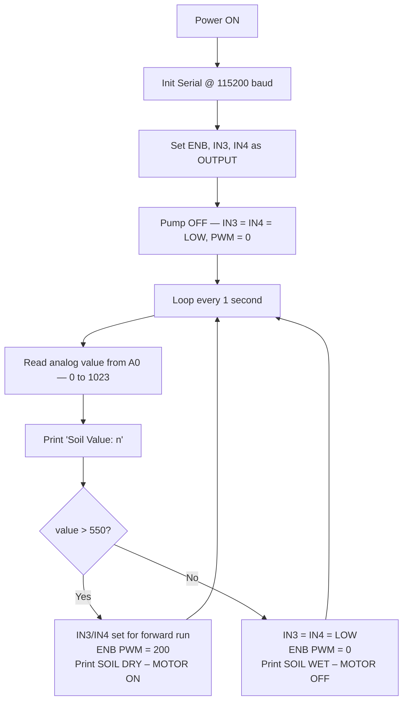

# 🌾 Automatic Field Watering System
### IoT-Enabled Automated Irrigation using NodeMCU (ESP8266)

*A low-cost embedded irrigation controller that senses soil moisture continuously, drives a DC water pump automatically through a motor driver, and streams live readings to the Arduino IDE Serial Monitor.*

Prepared by **G Indranag**

---

## ⚙️ How It Works

The system works on one physical fact: **wet soil conducts electricity better than dry soil.**

A resistive probe in the soil feeds a voltage to the NodeMCU's ADC. The firmware reads this value every second, compares it to a calibrated threshold (`550`), and does two things at once:

- 💧 Drives the **DC pump ON** (via the motor driver) or **OFF**, depending on soil condition
- 🖥️ Prints the raw ADC value and pump status to the Serial Monitor

> **Higher ADC value → drier soil. Lower ADC value → wetter soil.**
> The relationship is inverse because wet soil pulls the voltage divider output *down*.

---

## 🧩 Components

| Component | Specification |
|---|---|
| 🔷 NodeMCU ESP8266 | ESP-12E, 80 MHz, 3.3V logic |
| 🌱 Soil Moisture Sensor | Resistive probe, analog output |
| 🔀 Motor Driver Module | L298-type dual H-bridge |
| 💦 DC Water Pump | 6–12V brushed DC |
| 🔋 9V Battery | PP3 alkaline/rechargeable — powers pump side only |
| 🪣 Water Reservoir | Small metal/steel container (bench test) |
| 🔌 Jumper Wires | Male-to-male and male-to-female |
| 🔗 USB Cable | Micro-USB, data-capable |

---

## 🔌 Circuit Connections

| Signal | NodeMCU Pin | Direction |
|---|---|---|
| Soil sensor analog output | `A0` | Input |
| Motor driver ENB (speed) | `D1` | Output, PWM |
| Motor driver IN3 (direction) | `D2` | Output, digital |
| Motor driver IN4 (direction) | `D3` | Output, digital |
| Motor driver power | `9V Battery +/−` | Power (isolated from logic rail) |
| Common ground | `GND` | Reference |

> ⚠️ **Important:** The pump is never driven directly from a NodeMCU GPIO — a DC pump's running and inrush current far exceeds what a microcontroller pin can safely source. The motor driver's H-bridge isolates the 3.3V logic side from the higher-current motor side, while a separate 9V battery keeps the pump's electrical noise off the NodeMCU's own supply rail.

> 💡 D1, D2, and D3 are chosen specifically because they have **no boot-strapping restrictions** — other GPIO pins can prevent the board from booting if driven to the wrong level at power-up. D1 also supports PWM output, needed for pump speed control.

---

## 🔁 Firmware Logic

---

## 🛠️ Arduino IDE Setup

| Setting | Value |
|---|---|
| Board | `NodeMCU 1.0 (ESP-12E Module)` |
| CPU Frequency | `80 MHz` |
| Flash Size | `4 MB` |
| Upload Speed | `115200` |
| Serial Monitor Baud | `115200` |
| Libraries | None (core Arduino only — `analogRead`, `digitalWrite`, `analogWrite`) |

> 🔎 Serial monitor baud rate **must** match the firmware (`115200`). If you see garbled output, this is the first thing to check.

---

## 📊 Threshold Logic

| ADC Range | Soil Condition | Pump State | Serial Output |
|---|---|---|---|
| 0 – 550 | Wet / sufficient | ⚪ OFF | `SOIL WET – MOTOR OFF` |
| 551 – 1023 | Dry / insufficient | 🟢 ON (PWM 200) | `SOIL DRY – MOTOR ON` |

`550` was set empirically for the probe and soil sample used in development. Recalibrate for your specific soil type — see [Field Calibration](#-field-calibration).

---

## ✅ Test Results

| Condition | ADC Reading | Pump State | Serial |
|---|---|---|---|
| Dry soil / open air | 765 – 1024 | 🟢 ON, continuous PWM | `SOIL DRY – MOTOR ON` |
| Probe in water reservoir | 385 – 412 | ⚪ OFF, de-energised | `SOIL WET – MOTOR OFF` |

State transitions occurred on the **very next 1-second sampling cycle** after the probe was moved, confirming no hidden latency beyond the deliberate one-second loop delay. Pump behaviour and serial status agreed in **every** trial, and no abnormal current draw or heating was observed during testing.

---

## 🎯 Field Calibration

If you're deploying this with a different probe or soil type, calibrate the threshold before use:

1. Insert the probe into thoroughly **dry** soil. Record the stable reading — this is your **dry reference**.
2. Water the soil to the ideal moisture level for the plant. Wait a few minutes. Record the new stable reading — this is your **wet reference**.
3. Set the threshold between the two references, closer to the dry reference (so the pump favours turning on slightly early), then reflash.
4. Test by cycling between the two conditions — the pump should switch cleanly each time.

### Factors that affect readings

| Factor | Effect |
|---|---|
| 🧱 Soil composition | Clay retains water and salts better than sand — same water content, different conductivity |
| 🧪 Fertiliser content | Raises ionic concentration, lowers ADC value independent of moisture |
| 📏 Probe insertion depth | More contact area = lower resistance |
| 🔌 Supply voltage quality | A weak USB/battery source shifts the sensor divider output |

---

## ⚠️ Limitations

- 🦠 Resistive probes corrode over time from DC electrolysis — capacitive probes are better for long-term deployment
- 🔁 No hysteresis: a reading exactly at the boundary can toggle the pump between states on successive samples
- 📡 ESP8266 has only one ADC channel — monitoring multiple zones requires an external multiplexer
- 🐢 Pump runs at one fixed PWM speed rather than a speed proportional to how dry the soil is
- 💾 No data persistence — disconnecting the host PC loses all historical readings
- 🌦️ No weather/rainfall forecast integration — reacts only to the present reading

---

## 🚀 Future Enhancements

- [ ] Add hysteresis (two separate thresholds for wet→dry and dry→wet) to eliminate boundary flicker
- [ ] Average multiple samples before comparison to suppress ADC noise
- [ ] Publish readings and pump status via MQTT/HTTP to a cloud dashboard (ThingSpeak / Blynk) for remote monitoring
- [ ] Add multiple soil probes across different field zones, each with its own threshold
- [ ] Integrate a weather forecast API to suppress watering when rain is expected
- [ ] Power the probe from a GPIO pin (only energise during measurement) to reduce electrode corrosion
- [ ] Migrate to a capacitive soil probe for long-term stability
- [ ] Add solar charging for fully off-grid, continuous field operation

---
## 🙋 Author

**Galla Indranag**

B.Tech ECE
Embedded Systems & IoT Analyst (ESSCI-certified), (SRM AP)

- GitHub: [@indra675](https://github.com/indra675)
- LinkedIn: [linkedin.com/in/gallaindranag](https://linkedin.com/in/gallaindranag)
